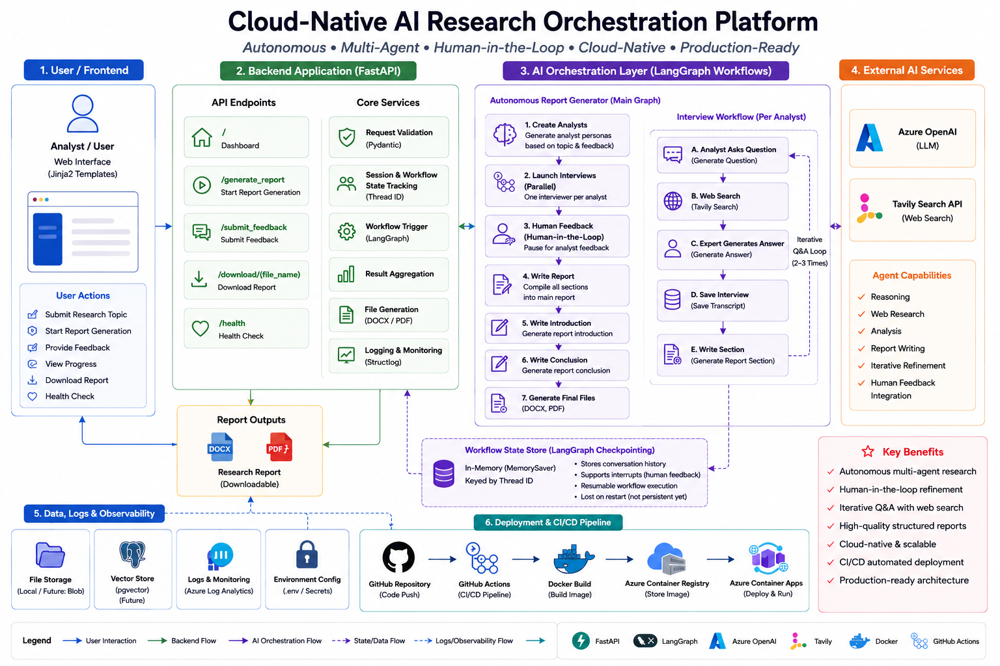
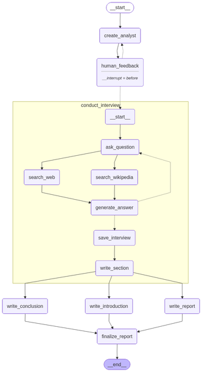

# Cloud-Native AI Research Orchestration Platform

## Overview

An enterprise-style AI-powered research report generation platform built using:

- FastAPI
- LangGraph
- Azure OpenAI
- Tavily Search
- Docker
- Azure Container Apps
- GitHub Actions CI/CD

The system autonomously generates structured research reports using multi-step AI orchestration workflows, web research, analyst-style reasoning, and iterative human feedback handling.

The application is fully containerized, cloud-deployed, and integrated with automated CI/CD pipelines for production-style deployment workflows.

---

# Key Features

- Autonomous AI research report generation
- Multi-step LangGraph workflow orchestration
- Multi-agent reasoning workflows
- Azure OpenAI integration
- Tavily-powered web research
- Human feedback integration loop
- FastAPI backend with Jinja2 frontend
- Dockerized production deployment
- Azure Container Apps hosting
- GitHub Actions CI/CD pipeline
- Health probes and cloud-native deployment setup
- Structured logging and monitoring support

---

# System Architecture

```text
User Request
    ↓
FastAPI Application
    ↓
LangGraph Workflow Engine
    ↓
Research + Reasoning Agents
    ↓
Azure OpenAI + Tavily Search
    ↓
Report Generation Pipeline
    ↓
DOCX / PDF Output
```

## High-Level Architecture



---

# LangGraph Workflow



---

# Tech Stack

## Backend

- FastAPI
- Gunicorn
- Uvicorn
- Jinja2

## AI / Orchestration

- LangGraph
- LangChain
- Azure OpenAI
- Tavily Search API

## Cloud / DevOps

- Docker
- Azure Container Registry (ACR)
- Azure Container Apps
- GitHub Actions

## Observability

- Structlog
- Azure Log Analytics

---

# Cloud Deployment

The application is deployed on:

- Azure Container Apps
- Azure Container Registry
- Azure OpenAI

Deployment includes:

- Docker-based containerization
- HTTPS ingress
- Health probes
- CI/CD automation
- Revision-based deployment
- Azure log monitoring

---

# CI/CD Pipeline

Automated deployment pipeline using GitHub Actions.

## Pipeline Flow

```text
GitHub Push
    ↓
GitHub Actions
    ↓
Docker Build
    ↓
Push to Azure Container Registry
    ↓
Deploy to Azure Container Apps
```

Every push to the `main` branch automatically:

- builds Docker image
- pushes image to Azure Container Registry
- deploys latest version to Azure Container Apps
- creates a new revision

---

# Sample Generated Reports

The platform generates enterprise-style research reports in both DOCX and PDF formats.

## Example Output

### Topic

Predictive AI in Insurance Industry

### Generated Files

| Format | File |
|---|---|
| DOCX Report | [Download DOCX](generated_report/Predictive_AI_in_Insurance_Industry_20260510_225846/Predictive_AI_in_Insurance_Industry_20260510_225846.docx) |
| PDF Report | [Download PDF](generated_report/Predictive_AI_in_Insurance_Industry_20260510_225846/Predictive_AI_in_Insurance_Industry_20260510_225846.pdf) |

## Report Capabilities

- Autonomous topic research
- Multi-agent reasoning workflow
- Web research integration
- Human-in-the-loop feedback
- Structured section generation
- DOCX and PDF export

---

# Local Development Setup

## Clone Repository

```bash
git clone https://github.com/BKD006/cloud-native-ai-research-platform.git
cd cloud-native-ai-research-platform
```

---

## Create Virtual Environment

```bash
uv venv venv
```

### Activate Virtual Environment

#### Windows

```bash
venv\Scripts\activate
```

#### Linux / Mac

```bash
source venv/bin/activate
```

---

## Install Dependencies

```bash
pip install -r requirements.txt
```

---

## Configure Environment Variables

Create a `.env` file:

```env
OPENAI_API_KEY=your_key
OPENAI_ENDPOINT=your_endpoint
TAVILY_API_KEY=your_key
```

---

## Run Application

```bash
uvicorn main:app --reload
```

Application URL:

```text
http://localhost:8000
```

Health Endpoint:

```text
http://localhost:8000/health
```

---

# Docker Setup

## Build Docker Image

```bash
docker build -t research-report-app .
```

---

## Run Docker Container

```bash
docker run --env-file .env -p 8000:8000 research-report-app
```

---

# Azure Deployment

The application is deployed using:

- Azure Container Apps
- Azure Container Registry
- Azure OpenAI
- GitHub Actions CI/CD

## Production Configurations

- Health probes
- HTTPS ingress
- Environment variable injection
- Revision-based deployment
- Runtime optimization
- Cloud-native container hosting

---

# API Endpoints

| Endpoint | Description |
|---|---|
| `/` | Dashboard |
| `/generate_report` | Start report generation |
| `/submit_feedback` | Submit analyst feedback |
| `/download/{file_name}` | Download generated reports |
| `/health` | Health check endpoint |

---

# Engineering Challenges Solved

This project involved solving several real-world production deployment issues including:

- Docker dependency resolution
- Azure Container Apps ingress setup
- Health probe failures
- LangGraph workflow state persistence
- Stateful AI orchestration in cloud containers
- Revision routing issues
- CI/CD deployment automation
- Cloud runtime debugging
- Gunicorn memory optimization

---

# Future Improvements

Planned production enhancements:

- PostgreSQL-based LangGraph checkpointing
- Azure Blob Storage integration
- Redis caching
- Background task queue
- Authentication and rate limiting
- Multi-user session persistence
- Monitoring dashboards
- Autoscaling optimization

---

# Lessons Learned

This project reinforced several important engineering principles:

- Local execution differs significantly from cloud execution
- AI systems require specialized deployment tuning
- Health probes are critical for AI workloads
- Stateful workflows require persistent checkpointing
- CI/CD automation is essential for production AI systems

---

# Production Status

Current deployment includes:

- Azure cloud deployment
- Docker containerization
- Automated CI/CD
- Health monitoring
- Production ingress
- AI workflow orchestration

---

# License

This project is intended for educational, research, and engineering demonstration purposes.